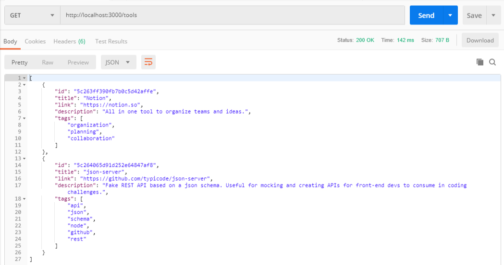
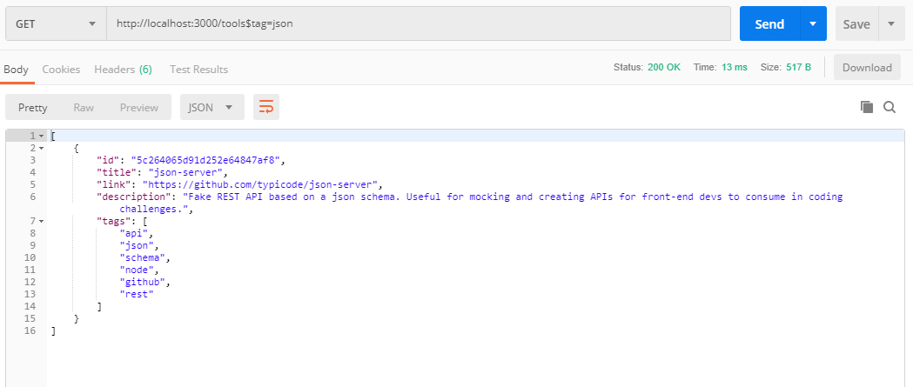
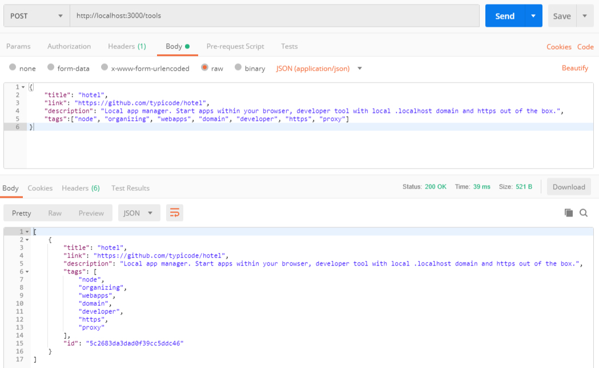
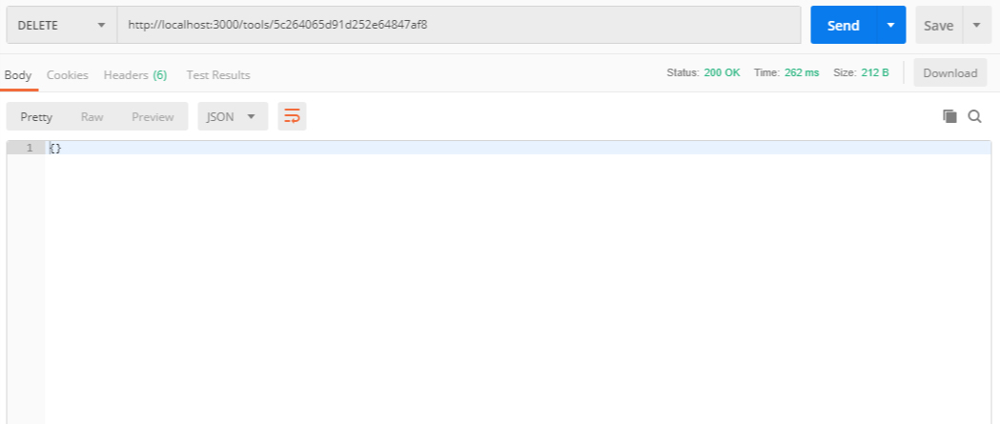

# API VUTTR

API para a aplicação VUTTR (Very Useful Tools to Remember). Um simples repositório para gerenciar ferramentas com seus respectivos nomes, links, descrições e tags.

## Instalação

1. Faça o clone deste projeto com `git clone https://github.com/marciofernandonet/vuttr.git`
2. Entre na pasta do projeto e instale as dependências com `npm install`

## Criando o banco de dados

1. O banco de dados para a aplicação é o [MongoDB](https://www.mongodb.com/), para inicializá-lo é preciso executar o comando `mongod` em um terminal separado.
2. Em outro terminal execute o seguinte comando `mongo` para usar o MongoDB.
3. Para criar um banco de dados basta utilizar o comando `use vuttr_db`, na aplicação o nome do banco é _vuttr_db_.
4. No MongoDB você não precisa criar a _coleção_, pois o mesmo cria a coleção automaticamente quando você insere algum _documento_, basta apenas executar o seguinte comando `db.vuttr.insert({"title": "Notion", "link": "https://notion.so","description": "All in one tool to organize teams and ideas.","tags":["organization", "planning","collaboration"]})`

## Rodando a API

Na pasta do projeto digite o seguinte comando para iniciar o servidor `npm start`, duas mensgens são exibidas _"Servidor rodando na porta: 3000"_ e _"Banco de dados conectado!"_. O arquivo de configução para o banco de dados é o _database.js_ e está na raiz do projeto, se precisar realizar alguma alteração, como exemplo a porta de conexão com o banco basta apenas editá-lo, mas por padrão a porta do MongoDB é a _27017_. 

## Testando a API

A API roda sobre o seguinte endereço `http://localhost:3000/`, para testar utilizaremos o [Postman](https://www.getpostman.com/), uma ferramenta que permite realizar requisições via HTTP.

### Listar todas as ferramentas

Para listar todas ferramentas usando o Postman basta selecionar a opção _GET_ no endereço `http://localhost:3000/tools`, em seguida clique em _Send_. Veja o exemplo abaixo. 


### Listar ferramentas utilizando uma busca por tag

Para listar ferramentas utilizando uma busca por _tag_ basta selecionar a opção _GET_ no endereço `http://localhost:3000/tools$tag=json`, em seguida clique em _Send_. No exemplo a tag para buscar é _json_. Veja o exemplo abaixo. 


### Cadastrar uma nova ferramenta

Para cadastrar uma nova ferramanta através do Postman basta selecionar a opção _POST_ no endereco `http://localhost:3000/tools` e logo baixo escolher a opção _Body_ e na sequência _raw_ e _JSON(application/json)_. Veja o exemplo a baixo usando uma requisição.

```json
{
    "title": "hotel",
    "link": "https://github.com/typicode/hotel",
    "description": "Local app manager. Start apps within your browser, developer tool with local .localhost domain and https out of the box.",
    "tags":["node", "organizing", "webapps", "domain", "developer", "https", "proxy"]
}
```


### Remover uma ferramenta por ID

Para remover uma ferramaneta pelo ID basta selecionar a opção _DELETE_ no seguinte endereço `http://localhost:3000/tools/5c264065d91d252e64847af8`, em seguida clique em _Send_. No exemplo _5c264065d91d252e64847af8_ é o ID a ser excluído. Veja o exemplo abaixo.


## Documento de API Blueprint

O documento da API Blueprint está no arquivo _api.apib_ localizado na pasta docs.